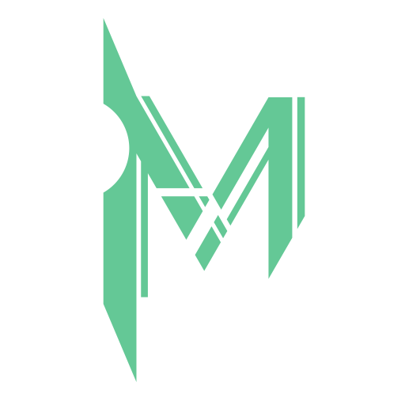

# Muek Framework

Muek Framework is a framework to build GUI application. 
[Muek](https://github.com/MuekDev/Muek) <del>is using</del> (will use actually) this framework. 
## Muek Framework is not complete now!
# Using Muek Framework
To use Muek Framework,you have to download MuekFramework folder and the content.
