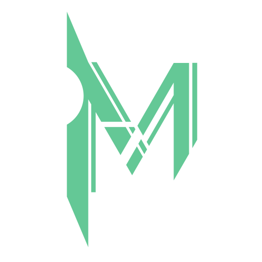

# Muek Framework
## Muek Framework is not complete now!

Muek Framework is a framework to build GUI application. 
[Muek](https://github.com/MuekDev/Muek). 
# Using Muek Framework
To use Muek Framework,you have to download MuekFramework folder and the content.
